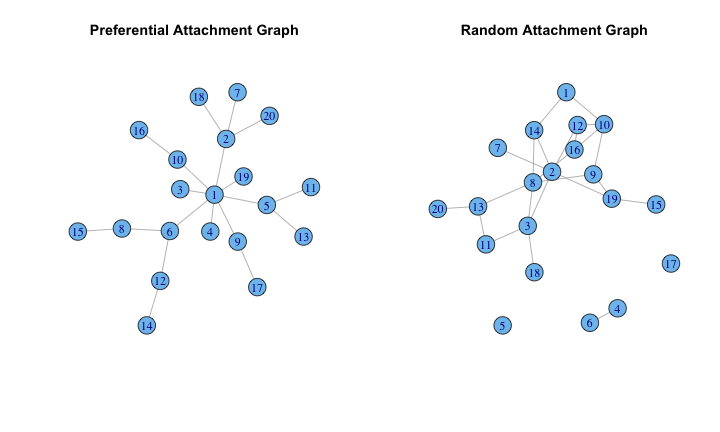
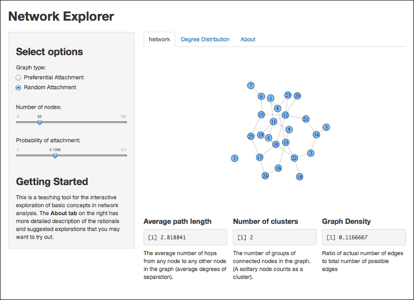
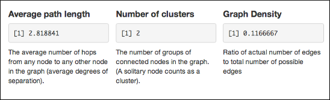
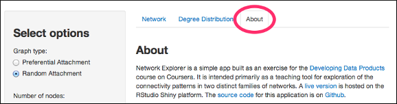

## Generate and plot two types of network graph


```r
library("igraph")  # package to generate and analyse networks
par(mfrow=c(1,2))
gba <- barabasi.game(20, directed=FALSE)  # 20-node, undirected graph
plot(gba, main="Preferential Attachment Graph")  # plot left graph
ger <- erdos.renyi.game(20, 0.12)  # 20 node, 12% attachment probability
plot(ger, main="Random Attachment Graph") # plot right graph
```

 


--- 

## Network Concepts

These two families of network are formed differently:

- **Preferential Attachment**: each new node added to the graph is more likely to attach itself to a popular node than to a less-connected node. (Think of Twitter celebrities attracting more followers than novices on the network).
- **Random Attachment**: each pair of nodes has a fixed probability of being connected by a common edge (12% in the previous example). Despite being among the first networks to be mathematically analysed, these networks would be rarely seen in nature or society.

These two behaviours have consequences for network structure and behaviour.

---

## The Application

The [Network Explorer Application](https://ggdata.shinyapps.io/barabasi/) allows a visual exploration of these behaviours. It plots and summarises graphs based on the network type, number of nodes, and probability of attachment that you select.



---

## Statistical Summaries

Beneath each graph are also displayed some numerical indices that summarise key aspects of graph connectivity:



- Watch how they change as you vary the selections of node numbers and probabilities.
- Explore also the **Degree Distribution** tab which gives the relative distribution of connectivity among the nodes of the graph.

---

## Explore Further

- Try out [the application](https://ggdata.shinyapps.io/barabasi/) directly and read the **About tab** for more resources:



- Explore the [igraph package](http://www.lsi.upc.edu/~CSN/lab/session1.pdf). Here, for e.g., we generate a "small world" network and find its average path length:


```r
ws_graph <- watts.strogatz.game(1, 100, 4, 0.05)
average.path.length(ws_graph)
```

```
## [1] 3.125
```

